# PortPulse AWS Architecture

```mermaid
graph TB
    %% ① 사용자 / 프론트엔드
    User[👤 사용자<br/>수출 중소기업]

    subgraph Frontend["① 웹 대시보드 (Frontend/Edge)"]
        Route53[Route 53]
        CF[CloudFront]
        S3Web[S3<br/>정적 웹 호스팅]
    end

    User --> Route53 --> CF --> S3Web
    CF -->|/api/*| APIGW

    %% ② API Gateway + Lambda
    subgraph API["② API Layer"]
        APIGW[API Gateway]
        ChatLambda[Lambda<br/>Chat API]
        MarketLambda[Lambda<br/>Market Data API]
        ShipmentLambda[Lambda<br/>Shipments API]
        AlertsLambda[Lambda<br/>Alerts API]
    end

    APIGW --> ChatLambda
    APIGW --> MarketLambda
    APIGW --> ShipmentLambda
    APIGW --> AlertsLambda

    %% ③ AI Core - Bedrock Agent (단일)
    subgraph AICore["③ AI Core: Amazon Bedrock Agent"]
        subgraph Agent["Bedrock Agent (단일)"]
            FM[Foundation Model<br/>Claude Sonnet 4]
            Guardrail[Bedrock Guardrail<br/>입출력 보호<br/>PII 익명화 / 투자조언 거부]
        end
        ActionLambda[Lambda<br/>Action Group<br/>DynamoDB 조회]
        KB[Knowledge Base<br/>RAG / S3 Vectors<br/>해운 도메인 문서]
        WebSearch[웹 검색 API<br/>실시간 정보]
    end

    ChatLambda -->|InvokeAgent| Agent
    Agent --> ActionLambda
    Agent --> KB
    Agent --> WebSearch
    Guardrail -.->|필터링| Agent

    %% ④ 데이터 저장 (DynamoDB)
    subgraph DataStore["④ 데이터 저장"]
        DDB_Market[DynamoDB<br/>시장 데이터 테이블<br/>KCCI/SCFI/환율/금리]
        DDB_News[DynamoDB<br/>뉴스 테이블]
        DDB_Shipment[DynamoDB<br/>선적 / 경보 테이블]
        DDB_History[DynamoDB<br/>과거 지수 히스토리<br/>그래프용]
    end

    ActionLambda --> DDB_Market
    ActionLambda --> DDB_News
    ActionLambda --> DDB_Shipment
    MarketLambda --> DDB_Market
    MarketLambda --> DDB_History
    ShipmentLambda --> DDB_Shipment
    AlertsLambda --> DDB_Shipment

    %% ⑤ 데이터 수집 (EventBridge + Lambda)
    subgraph Collection["⑤ 시장 데이터 수집 (EventBridge 스케줄)"]
        EB[EventBridge<br/>Scheduler]
        CollectorKCCI[Lambda<br/>KCCI 수집]
        CollectorSCFI[Lambda<br/>SCFI 수집]
        CollectorECOS[Lambda<br/>ECOS 환율/금리]
        CollectorCustoms[Lambda<br/>관세청 수출실적]
        CollectorNews[Lambda<br/>뉴스 수집]
    end

    subgraph ExtAPI["외부 API"]
        API_KCCI[KCCI API<br/>부산발 운임]
        API_SCFI[SCFI API<br/>상하이 운임]
        API_ECOS[ECOS API<br/>환율/금리]
        API_Customs[관세청 API<br/>수출실적]
        API_News[뉴스 API]
    end

    EB --> CollectorKCCI
    EB --> CollectorSCFI
    EB --> CollectorECOS
    EB --> CollectorCustoms
    EB --> CollectorNews

    CollectorKCCI --> API_KCCI
    CollectorSCFI --> API_SCFI
    CollectorECOS --> API_ECOS
    CollectorCustoms --> API_Customs
    CollectorNews --> API_News

    CollectorKCCI --> DDB_Market
    CollectorSCFI --> DDB_Market
    CollectorECOS --> DDB_Market
    CollectorCustoms --> DDB_Market
    CollectorNews --> DDB_News

    %% ⑥ Push 알림
    subgraph Push["⑥ Push 전달 (매일 정기 + 이벤트 경보)"]
        NotifierLambda[Lambda<br/>알림 발송]
        Telegram[텔레그램]
        Kakao[카카오톡]
    end

    EB -->|매일 06:30 KST| NotifierLambda
    NotifierLambda -->|Agent 호출<br/>브리핑 생성| Agent
    NotifierLambda --> Telegram
    NotifierLambda --> Kakao
    NotifierLambda --> DDB_Shipment

    %% ⑦ 초기 배포
    subgraph Init["⑦ 초기 배포"]
        InitLambda[Lambda<br/>DB Initializer]
        HistoryData[과거 지수 데이터<br/>KCCI/SCFI 히스토리]
    end

    InitLambda -->|배포 시 bulk insert| DDB_History
    HistoryData --> InitLambda

    %% 스타일
    classDef aws fill:#FF9900,stroke:#232F3E,color:#232F3E
    classDef bedrock fill:#6B48FF,stroke:#232F3E,color:#fff
    classDef dynamo fill:#4053D6,stroke:#232F3E,color:#fff
    classDef lambda fill:#FF9900,stroke:#232F3E,color:#232F3E

    class Route53,CF,S3Web,APIGW aws
    class Agent,FM,Guardrail,KB bedrock
    class DDB_Market,DDB_News,DDB_Shipment,DDB_History dynamo
    class ChatLambda,MarketLambda,ShipmentLambda,AlertsLambda,ActionLambda,CollectorKCCI,CollectorSCFI,CollectorECOS,CollectorCustoms,CollectorNews,NotifierLambda,InitLambda lambda
```

## 핵심 포인트

1. **단일 Bedrock Agent** (서브에이전트 없음) - FM(Claude Sonnet 4) + Guardrail
2. **Agent 연결 3가지:** Lambda(Action Group, DynamoDB 조회) + KB(RAG) + 웹 검색 API
3. **DynamoDB:** 시장데이터/뉴스/선적/과거히스토리 테이블
4. **EventBridge → 각 수집 Lambda → 외부 API → DynamoDB** 저장
5. **초기 배포 시** 과거 지수 데이터 bulk insert (그래프용)
6. **Guardrail:** prompt injection 차단, PII 익명화, 투자조언 거부
